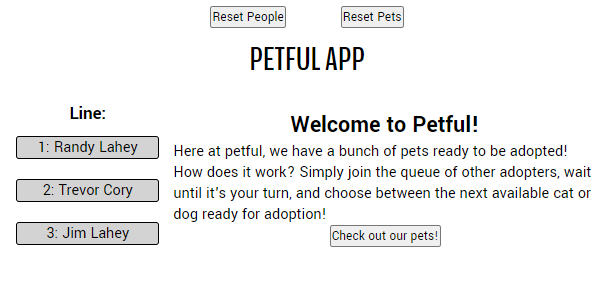
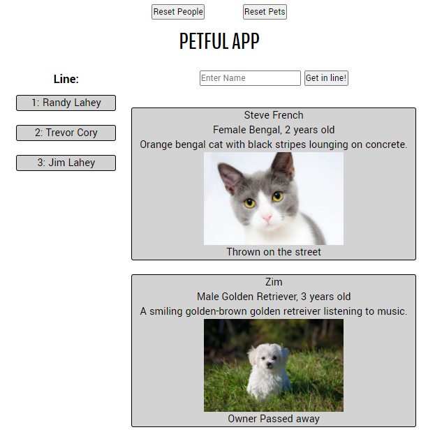
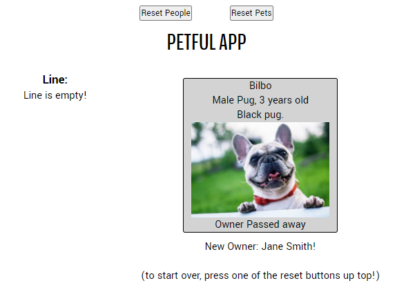

# Petful App - React Client Prototype!

Puts cats and dogs into a queue, while waiting for people to line up and adopt them!

## Vercel Deploy: https://petful-inky.vercel.app/

## Petful API: https://petful-app-server.herokuapp.com/petful/

## Pages:

### / (home)

- Basic splash page explaining how to interface with the app.

### /pets

- This is where a user can enter the line to be eligible for pet adoption
- Once a name is entered, there's a simulated adoption process to move the line along, each person choosing either a cat or dog
- Once iot's the user's turn, buttons to adopt will appear under each pet, once pressed moving the user to the final adopted page

### /adopted

- Adoption is successful, showing the adopted pet with it's new owner listed below
- To continue using the prototype, you can use the reset buttons at the top

### Reset Buttons:

- resets local data store to default for either pets or people

1. Reset People:
   > Resets the line so you can continue on cycling through the pets
2. Reset Pets
   > Resets pets back to the beginning

## Tech Stack:

1. Express Server
   > link to repo: https://github.com/thinkful-ei-rabbit/Petful_Server
2. React Typescript Client
   > prototype utilizing the Petful API
